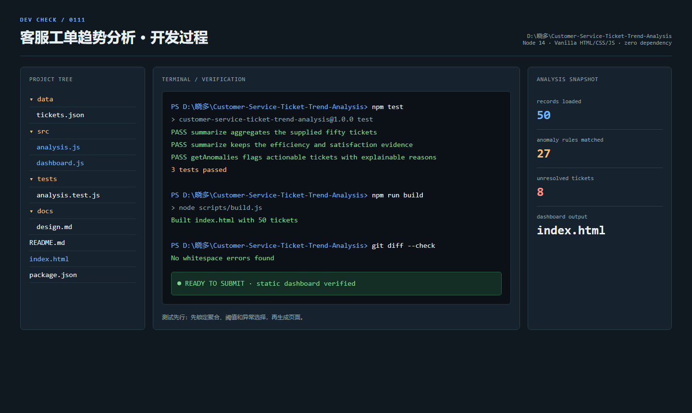
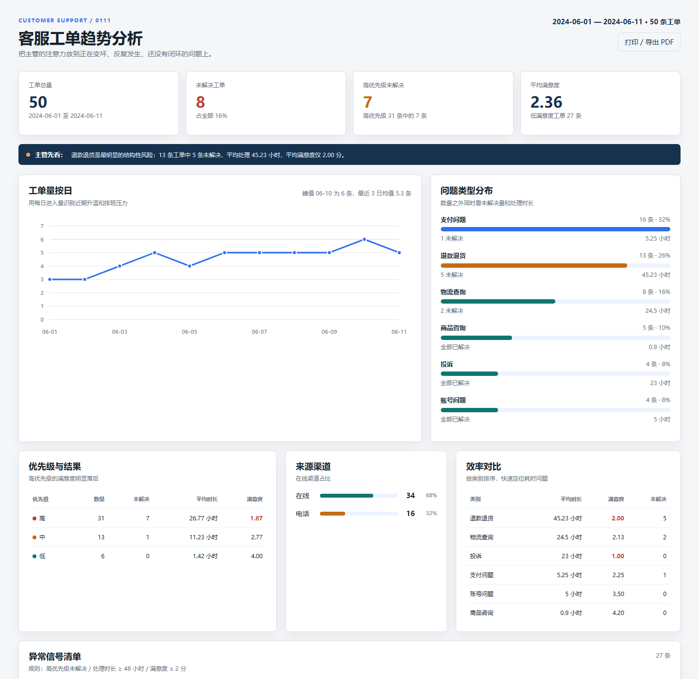

# 0111 · 客服工单趋势分析

一个无需安装依赖、双击即可打开的静态 Dashboard。它对附件中的 50 条客服工单做聚合分析，并把需要主管优先关注的异常工单列出来。

## 快速查看

直接双击仓库根目录的 [`index.html`](./index.html) 即可打开；页面没有外部 CDN 和后端服务。

命令行复现：

```bash
npm test
npm run build
```

`npm test` 使用 Node 内置能力验证分析规则；`npm run build` 将 `data/tickets.json`、`src/analysis.js` 和 `src/dashboard.js` 内嵌到 `index.html`。

## 分析维度设计

| 维度 | 计算方式 | 对主管决策的价值 |
| --- | --- | --- |
| 时间趋势 | 按创建日期统计工单量，展示峰值日和最近 3 日均值 | 判断是否升温、提前安排排班和处理容量 |
| 问题类型 | 按 `category` 统计数量、占比、未解决量、平均处理时长、平均满意度 | 找到最值得投入流程/人力的业务问题，而不是只看数量 |
| 优先级与状态 | 交叉统计 `priority`、`is_resolved`，单列高优先级未解决 | 先处理可能影响体验和升级风险的积压 |
| 处理效率 | 比较各类别和优先级的平均 `resolution_time_hours` | 识别 SLA 或流程卡点，区分“量大”和“难处理” |
| 满意度 | 比较总体、类别、优先级平均 `satisfaction`，标记 ≤ 2 分 | 发现用户感知已经恶化但还未必形成大量投诉的问题 |
| 渠道与原文 | 比较在线/电话渠道，并在异常表保留用户描述 | 判断入口压力，同时避免聚合数字脱离具体问题语境 |

## 关键发现

1. **退款退货是首要结构性风险。** 13 条，占全部 26%；其中 5 条未解决，平均处理 45.23 小时，平均满意度 2.00 分。它不是单纯“量大”，而是同时出现积压、耗时和低满意度。
2. **支付问题数量最多，但呈现重复型故障。** 16 条，占 32%；描述集中在扣款成功但订单未生成、重复扣款、金额不一致等支付链路问题，适合交给支付/订单系统一起排查。
3. **工单量在样本后段维持高位。** 6 月 1 至 3 日日均 3.3 条，6 月 9 至 11 日日均 5.3 条；6 月 10 日达到峰值 6 条。样本只有 11 天，因此这里作为运营预警信号，不表述为统计显著增长。
4. **高优先级工单占比过高且体验最差。** 31 条为高优先级，其中 7 条仍未解决；高优先级平均满意度 1.87 分，低于中优先级 2.77 分和低优先级 4.00 分。
5. **整体体验偏弱。** 平均满意度只有 2.36/5；50 条中 27 条满意度 ≤ 2 分，8 条未解决，其中 7 条是高优先级。
6. **在线是主要入口。** 在线 34 条，占 68%；电话 16 条，占 32%。在线入口需要优先承接自助分流和机器人升级策略，但投诉类原文也提示机器人重复回复的问题。

## 异常规则与结果

Dashboard 的异常清单使用可复核的固定规则：

- 高优先级且未解决：立即关注；
- 处理时长 `>= 48` 小时：长时处理；
- 满意度 `<= 2` 分：低满意度；
- 一条工单可同时命中多个规则，页面会把判断依据合并展示。

按上述规则，50 条工单中有 **27 条命中至少一个异常规则**。其中最需要优先处理的是退款退货未解决工单：T031（120 小时）、T047（96 小时）、T042（72 小时）、T036（24 小时）、T039（36 小时）；另有 T046 为“重复扣款再次发生”且高优先级未解决，属于支付链路的复发信号。

## 项目结构

```text
index.html                 # 可直接双击打开的最终交付物
index.template.html        # 页面模板和样式
data/tickets.json          # 50 条原始工单数据
src/analysis.js            # 纯聚合、阈值和异常判断逻辑
src/dashboard.js           # 浏览器渲染逻辑
scripts/build.js           # 生成单文件 index.html
tests/analysis.test.js     # Node 14 可运行的统计规则测试
outputs/                   # 开发过程和运行结果截图
```

## 截图

开发过程：



运行结果：



## AI 工具使用情况

使用 AI 辅助完成了分析维度设计、异常规则梳理、页面结构与视觉布局、前端代码编写、测试用例设计和数据结果复核。原始工单数据只作为输入进行统计；最终结论均由仓库中的 `src/analysis.js` 按固定规则计算，未把模型生成的描述直接当作数据事实。

## 交付方式

本项目适合直接作为 Git 仓库提交。当前页面为离线静态交付，不要求部署地址；仓库中保留源码、数据、测试和截图，便于复查与重新构建。
